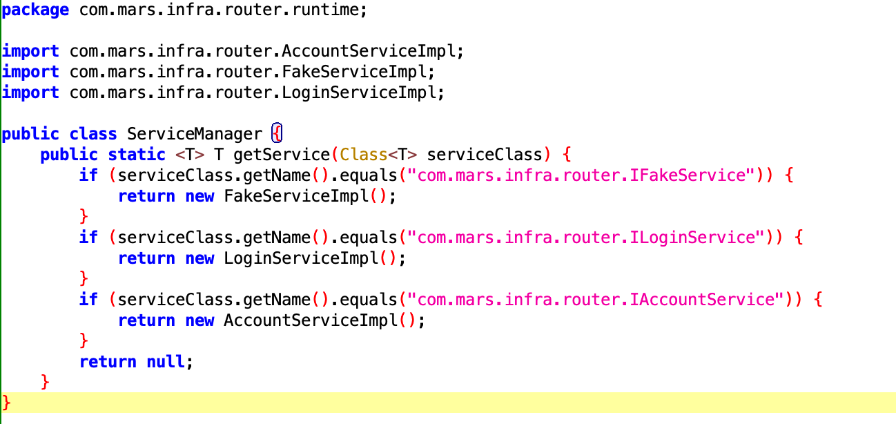

# MarsRouter

### 概述

路由小玩具

### TODO

路由表生成：

- [ ] 类名不固定，随机

路由表注册：

- [x] 静态注册，优化运行时反射性能消耗
- [x] gradle插件单独成library
- [ ] gradle插件多线程优化
- [x] 增量编译
- [ ] gradle.kts

path分发：

- [ ] 拦截器（1.责任链；2.AOP？）
- [ ] 支持自定义拦截器（注解形式？）

spi：

- [x] 支持组件间方法调用
- [ ] 支持单例
- [ ] 支持方法降级

其他：

- [ ] 解环？

### spi

目的：支持组件间的方法调用 

示例代码如下：
```
val loginService  = Router.getService(ILoginService::class.java)
loginService.login()
```
核心思路：
通过Router的getService方法，返回ILoginService对应的实现类。
这里利用ASM在编译期生成new LoginServiceImpl()代码，无须运行时反射拿到实现类。

在Transform阶段，遍历两次class文件，第一次收集ServiceImpl注解，第二次对ServiceManager的getService方法进行代码插入。  

反编译代码如下：
